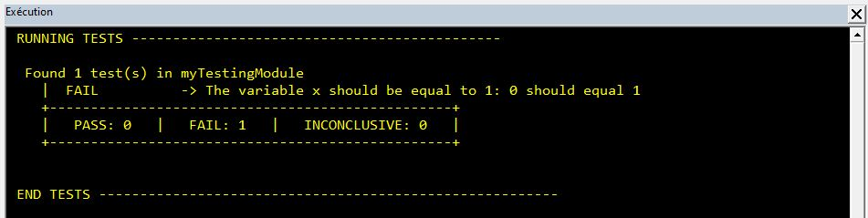
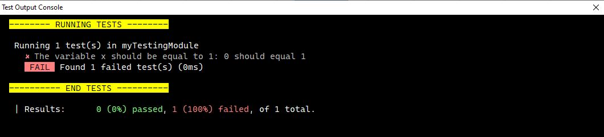

# VBA Unit Testing Framework

This project is aimed at building a framework for automatic unit testing in Excel VBa projects using best OOP practices and Clean Code (design patterns, SOLID principles...)

## Unit testing principles

Writing (or reading) tests should be easy and obvious. This framework with fluent keywords. Here is an example:

```vb
Assert.Test("The variable x should take the value 1").Expect(x).ToBeEqualTo(1)
```

The test will return one of the three outcomes:
- ```PASS``` if the test passes,
- ```FAIL``` if the test fails,
- ```INCONCLUSIVE``` if the test cannot be evaluated.

In the above example if the variable  ```x``` is not a number, then the result of the test will be ```INCONCLUSIVE```.

## Test result output

The results of the tests can be read via two different output methods:
- In the ugly VBE immediate window



- In a beautiful userform, that plays the role of a custom console (providing with text formatting options lacking in the VBE debug immediate window



## Running the tests
The test are run by executing a ````Sub```` written in a simple module. Inside this ````Sub```` should be defined a ```TestRunner``` object. This object have two important methods:
- ```.AddTestSuite(ByVal macroName as string)``` specifies the name of the ````Sub```` containing the ````Assert```` commands
- ````.Run```` which starts the whole testing process

### Example

The test here will be run by executing the macro ``RunTests()``:

```vb
Public Sub RunTests()
    With New TestRunner
        .AddTestSuite "myTestingModule"
        .Run
    End With
End Sub

Public Sub myTestingModule()
    Dim x As Integer
    Assert.test("The variable x should be equal to 1").Expect(x).ToEqual (1)
End Sub
```
A ```TestRunner``` object can have as many test suites as desired. Every test suite ```Sub``` can have as many ```Assert``` commands as desired.


## API

The Assert object can be described using the .Test method
```vb 
.Test(ByVal descriptionText as String)
```

This method is optional.

The ExpectedAssert object

Available tests comparison methods

```vb
.ToEqual(byVal value as variant)
```
```vb
.ToBeDifferentFrom(byVal value as variant)
```
```vb
.ToBeLargerThan(byVal value as variant)
```
```vb
.ToBeLargerOrEqualTo(byVal value as variant)
```
```vb
.ToBeSmallerThan(byVal value as variant)
```
```vb
.ToBeSmallerOrEqualTo(byVal value as variant)
```
```vb
.ToHaveMethod(byval methodName as string)
```
```vb
.ToBeTrue()
```
```vb
.ToBeFalse()
```
```vb
.ToBeNothing()
```
```vb
.ToBeSomething()
```
